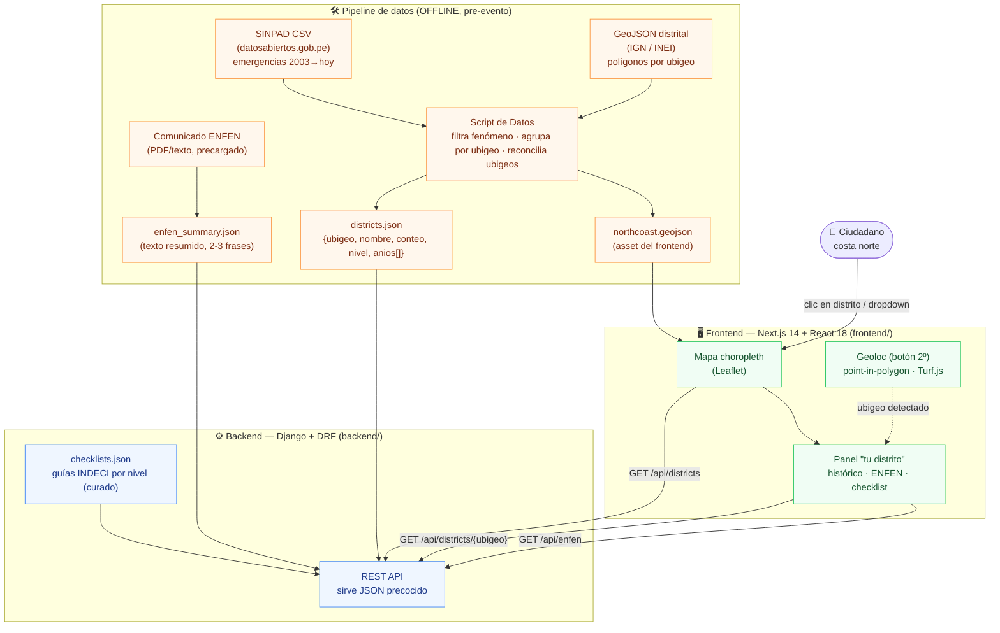
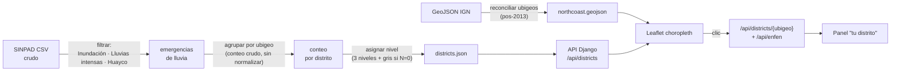
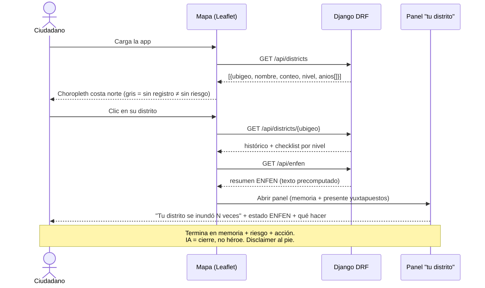
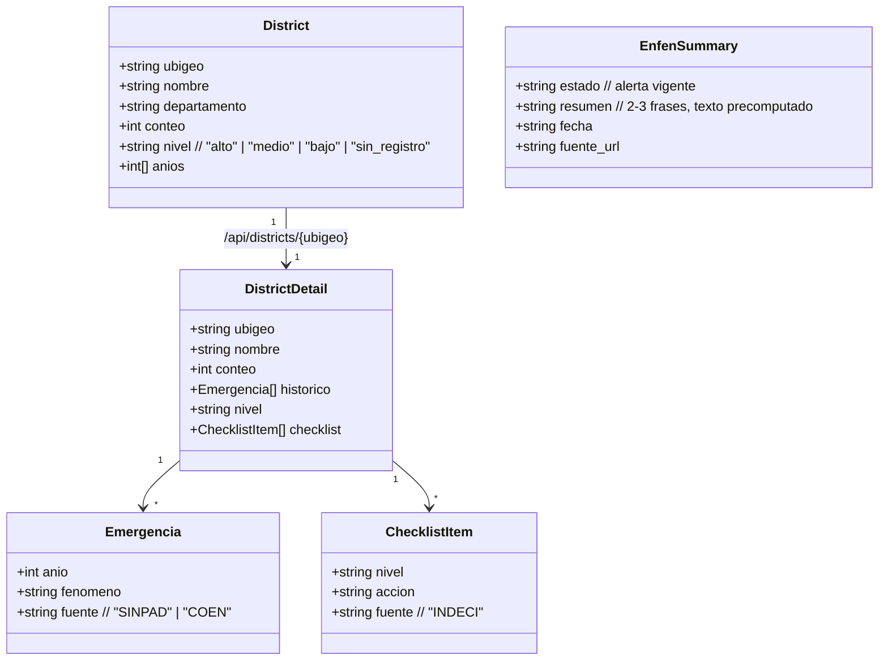
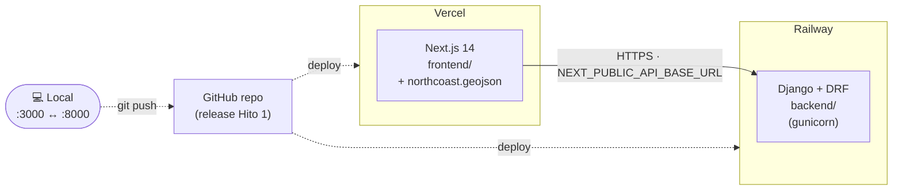

# Vigía — Arquitectura

> Diagramas del prototipo de arquitectura (Hito 1). Alcance cerrado en [`CONTEXT.md`](../CONTEXT.md); justificación extendida en [`vigia-brief.md`](vigia-brief.md).
>
> **Principio rector:** monolito pragmático, nada en vivo en la demo. El frontend consume **JSON estático precocido** servido por una API Django; el dato real de SINPAD se procesa **offline** antes del evento.

---

## 1. Módulos principales y cómo se comunican

**Comunicación:** un único contrato HTTP/JSON entre `frontend` (Next.js) y `backend` (Django DRF). Sin microservicios, sin base de datos en runtime: la API lee artefactos JSON precocidos. El GeoJSON distrital vive como asset del frontend (es geometría, no cambia).

---

## 2. Flujo de datos: de la fuente pública a la pantalla

> **Regla de oro:** densidad sobre cobertura. El clímax necesita ~10–15 distritos de costa norte coloreados de forma convincente, no los 1.870 nacionales. Plan-B si el CSV falla (timebox 90 min): ~15 distritos anclados al reporte COEN (Piura: 91.835 damnificados; Catacaos ≈ 45 mil).

---

## 3. Secuencia: "tu distrito" (clímax de la demo)

---

## 4. Modelo de datos (artefactos precocidos)

No hay base de datos en runtime para el MVP. Estos son los esquemas de los JSON que sirve la API.

### Endpoints (Django DRF — sobre el starter de `backend/api/`)

| Método | Ruta | Devuelve |
|---|---|---|
| `GET` | `/api/districts` | Lista costa norte `{ubigeo, nombre, conteo, nivel, anios[]}` para el choropleth |
| `GET` | `/api/districts/<ubigeo>` | Detalle: histórico + resumen ENFEN (texto) + checklist por nivel |
| `GET` | `/api/enfen` | Estado/comunicado ENFEN resumido (precargado) |
| `GET` | `/health` | Liveness probe *(del starter)* |
| `GET` | `/api/items` | Mock del starter — **se reemplaza** |

---

## 5. Despliegue

- **Frontend:** Vercel (URL pública automática). Var `NEXT_PUBLIC_API_BASE_URL` → backend desplegado.
- **Backend:** Railway (`gunicorn config.wsgi`, ver `backend/Procfile` / `backend/railway.toml`). Setear `CORS_ORIGINS`, `ALLOWED_HOSTS`, `SECRET_KEY`, `DEBUG=False`.
- **Datos:** los JSON precocidos se versionan en el repo (sin red en vivo en la demo).

---

## Decisiones de diseño que la arquitectura respeta

- **Agencia, no amenaza:** toda respuesta termina en *memoria + nivel de riesgo + acción*; nunca un diagnóstico binario.
- **IA = una sola llamada, y para la demo es texto precomputado** (coherente con "nada en vivo"). Llamada real al modelo = roadmap.
- **Sin fórmula combinada de riesgo:** memoria histórica y estado ENFEN se muestran **yuxtapuestos**.
- **Sin verde engañoso:** distritos sin registro van en **gris explícito** ("no significa sin riesgo").
- **Susceptibilidad ≠ registro:** mostramos lo que ocurrió, no predicción.
