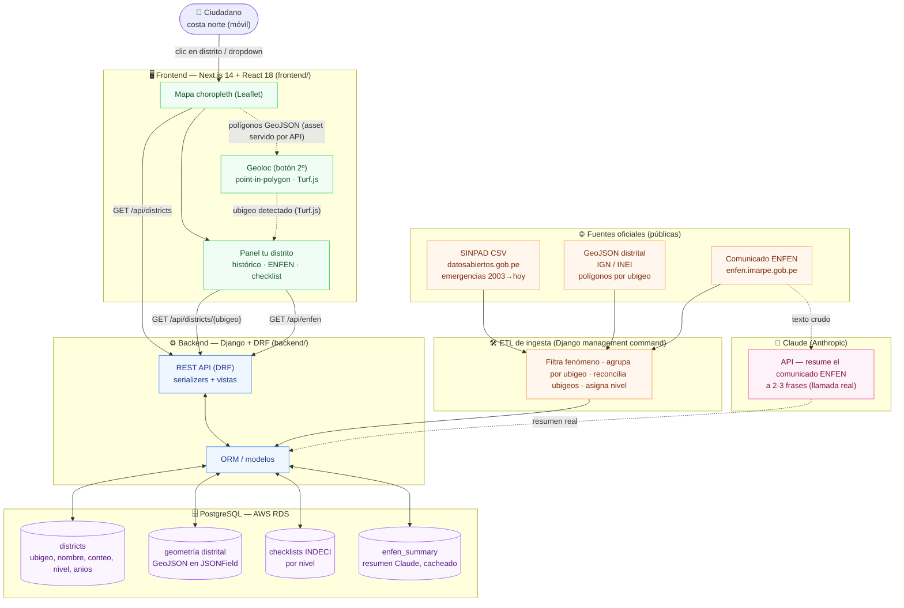
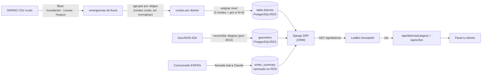
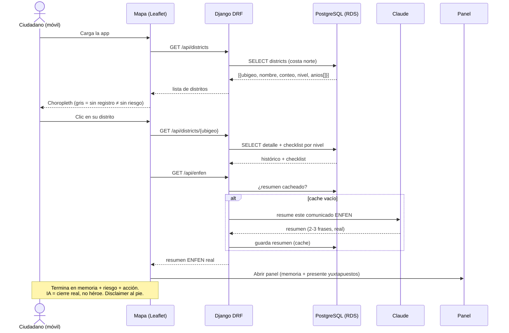
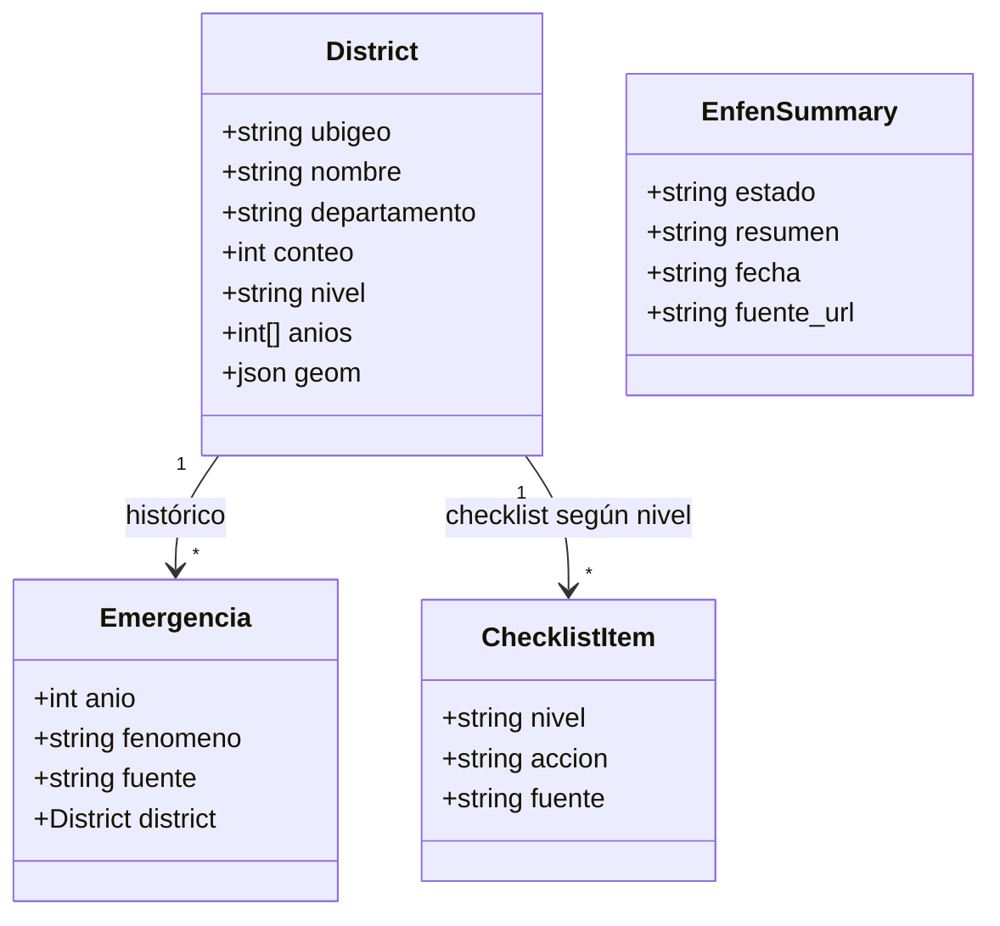
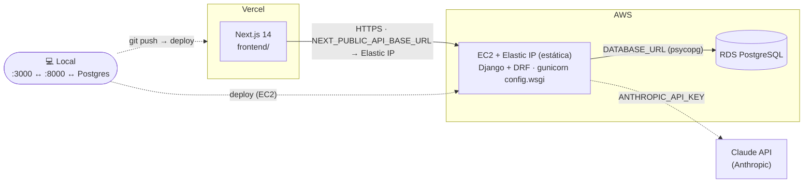

# Vigía — Arquitectura

> Diagramas del prototipo de arquitectura (Hito 1). Alcance cerrado en [`CONTEXT.md`](../CONTEXT.md); principios en [`constitution`](../.specify/memory/constitution.md) (v2.0.0); justificación extendida en [`vigia-brief.md`](vigia-brief.md).
>
> **Principio rector:** monolito pragmático con **integración real y datos reales**. El frontend (Next.js) consume una API Django DRF que sirve datos desde una **base de datos real PostgreSQL en AWS RDS**. Un **ETL** carga la data de las fuentes oficiales (SINPAD, ENFEN, GeoJSON IGN/INEI) en la BD antes/durante el evento; la app sirve esa data **en vivo desde la BD**. El resumen ENFEN se genera con una **llamada real al modelo Claude (Anthropic)**, cacheada en la BD. Nada hardcodeado ni fake. Toda la información vive en el backend (Principio VIII: escalabilidad y mantenibilidad).

---

## 1. Módulos principales y cómo se comunican

**Comunicación:** un único contrato HTTP/JSON entre `frontend` (Next.js) y `backend` (Django DRF).
El backend es la **única fuente de verdad**: toda la información (conteos, geometría, checklists,
resumen ENFEN) vive en **PostgreSQL (AWS RDS)** y se sirve por la API vía el ORM. El frontend no
embebe data ni GeoJSON — los pide al backend (Principio VIII). El ETL es un *management command*
de Django que se corre antes/durante el evento para poblar la BD con datos reales.

---

## 2. Flujo de datos: de la fuente pública a la pantalla

> **Regla de oro:** densidad sobre cobertura. El clímax necesita ~10–15 distritos de costa norte
> coloreados de forma convincente con **datos reales**, no los 1.870 nacionales. Plan-B si el CSV
> de SINPAD falla (timebox 90 min): ~15 distritos anclados al reporte COEN (Piura: 91.835
> damnificados; Catacaos ≈ 45 mil) — sigue siendo dato real, cargado en la misma BD.

---

## 3. Secuencia: "tu distrito" (clímax de la demo)

---

## 4. Modelo de datos (PostgreSQL / Django ORM)

Modelos ORM persistidos en PostgreSQL (AWS RDS). El ETL los puebla; la API los sirve.

### Endpoints (Django DRF — sobre el starter de `backend/api/`)

| Método | Ruta | Devuelve | Fuente |
|---|---|---|---|
| `GET` | `/api/districts` | Lista costa norte `{ubigeo, nombre, conteo, nivel, anios[]}` para el choropleth | BD |
| `GET` | `/api/districts/<ubigeo>` | Detalle: histórico + checklist por nivel (+ geometría si aplica) | BD |
| `GET` | `/api/enfen` | Resumen ENFEN real (Claude), cacheado en BD | BD + Claude |
| `GET` | `/health` | Liveness probe *(del starter)* | — |
| `GET` | `/api/items` | Mock del starter — **se reemplaza** | — |

> **Decisión:** geometría como **GeoJSON en un `JSONField`** de Postgres (sin PostGIS). El backend
> es la única fuente de verdad y sirve los polígonos por la API; el mapa los pinta y la geoloc (P4)
> resuelve el point-in-polygon en el front con **Turf.js** (`booleanPointInPolygon`) sobre esos mismos
> polígonos. PostGIS + geoloc server-side queda como upgrade de roadmap.

---

## 5. Despliegue

- **Frontend:** Vercel (URL pública automática). Var `NEXT_PUBLIC_API_BASE_URL` → Elastic IP del EC2.
- **Backend:** **EC2 con Elastic IP (estática)** dentro de AWS, junto a RDS. `gunicorn config.wsgi`
  detrás de Nginx, setear `ALLOWED_HOSTS` (Elastic IP/dominio), `CORS_ORIGINS`, `SECRET_KEY`, `DEBUG=False`.
- **Base de datos:** **PostgreSQL en AWS RDS**. El ETL corre como management command para poblarla.
- **IA:** `ANTHROPIC_API_KEY` en el backend; la llamada a Claude vive en el servidor, nunca en el front.
- **Plan-B de infra:** si RDS se complica en tiempo, la misma app corre contra Postgres local
  (o SQLite) sin cambiar código — solo la cadena de conexión (Principio VIII: capas limpias).

---

## 6. Alcance y orden de degradación (si el tiempo aprieta)

Decisión de equipo: **real pero con plan de recorte** — BD real + IA real, y si el tiempo aprieta se
recorta por prioridad, **nunca** se mete data fake.

- **In-scope hoy (las 4 historias):** P1 mapa de memoria (clímax) · P2 acción (nivel + checklist
  INDECI) · P3 resumen ENFEN real (Claude) · P4 geoloc (botón 2º, Turf.js en el front).
- **Orden de recorte si falta tiempo:** primero **P4 geoloc**; luego degradar **P3** a un resumen
  ENFEN ya generado/cacheado (sigue siendo salida real del modelo, no fake). **P1 y P2 son intocables**
  — son la pantalla. El clímax (clic en distrito) nunca se recorta.

---

## Decisiones de diseño que la arquitectura respeta

- **Integración real, datos reales (Ppio. II):** BD PostgreSQL/RDS + llamada real a Claude; nada hardcodeado ni fake en la demo.
- **Escalabilidad y mantenibilidad (Ppio. VIII):** toda la info vive en el backend/BD, no en el front; capas limpias (modelos · serializers · vistas); un MVP que escala a Nacional sin reescribir.
- **Agencia, no amenaza (Ppio. I):** toda respuesta termina en *memoria + nivel + acción*; nunca diagnóstico binario.
- **Sin fórmula combinada de riesgo:** memoria histórica y estado ENFEN se muestran **yuxtapuestos**.
- **Sin verde engañoso:** distritos sin registro van en **gris explícito** ("no significa sin riesgo").
- **Susceptibilidad ≠ registro:** mostramos lo que ocurrió, no predicción.
- **Mobile-first (Ppio. VII):** la app se consume en celular; responsive desde el inicio.
